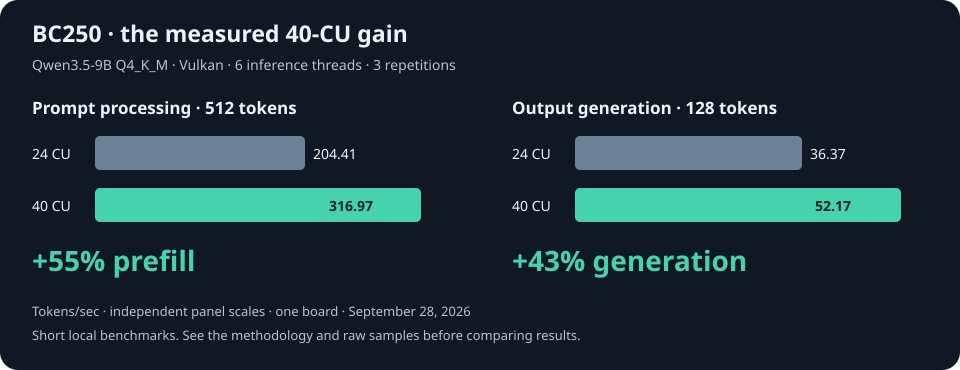
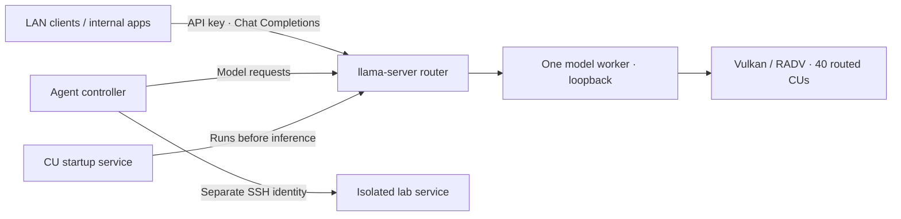

# BC250 · a small AI server with 40 CUs

**8 Zen 2 cores · 16 GB shared memory · Vulkan inference · Qwen3.5-9B · OpenAI-compatible LAN API**

My build log for turning an AMD BC250 into an inference server for internal application testing and server-administration experiments. The working configuration combines an eight-core BIOS setup with a software-applied 40-CU GPU unlock. The original measurements used an 8/8 memory split; the later Q36 evaluation moved to a 512 MiB GPU reservation and expanded GPU access to shared memory.

The most useful result: **Qwen3.5-9B Q4_K_M generates about 52 tokens/sec in the isolated benchmark**, up from 36 tokens/sec at 24 CUs. The production API delivered about 49 tokens/sec in a separate short request.



> Measurements from one board on September 28, 2026. Three repetitions per isolated benchmark; short tests, not a long-duration reliability qualification. Prompt processing and output generation are separate measurements.

[Build](docs/build.md) · [Firmware & CU unlock](docs/firmware.md) · [Benchmarks](docs/benchmarks.md) · [Models & agent tests](docs/models.md) · [API](docs/api.md)

## The build

| Component | Tested configuration |
|---|---|
| Board | AMD BC250 / Cyan Skillfish, gfx1013 |
| CPU | 8 cores / 16 threads after BIOS configuration; originally 6 / 12 |
| Memory | 16 GB shared GDDR6; now 512 MiB GPU reservation and about 14.85 GiB Linux RAM; original benchmarks used 8/8 |
| GPU | 40 CUs routed at runtime; factory driver topology remains 24 |
| Storage | 512 GB NVMe; approximately 100 GB root logical volume |
| OS | Ubuntu 24.04.5 LTS |
| Kernel | 6.8.0-142-generic |
| Driver | Mesa RADV 25.2.8 |
| Runtime | llama.cpp, Vulkan backend, pinned commit `4da6337767f973e2b4d0797e5b323d77d8565e4a` |
| Default model | Qwen3.5-9B Q4_K_M, 8K context, reasoning off |
| Serving | LAN API, API-key authentication, systemd, one model resident at a time |

The case, power supply, fan arrangement, wall power and total purchase cost have not been recorded for this write-up. There are no power-efficiency claims here.

## What the GPU unlock changed

All rows below use eight available CPU cores, the same Qwen weights and the same runtime. “Threads” is the inference thread setting, not the number of CPU cores enabled in BIOS.

| GPU configuration | Threads | Prompt processing, 512 tokens | Generation, 128 tokens | Peak sampled GPU edge temperature |
|---|---:|---:|---:|---:|
| 24 CUs | 6 | 204.41 tok/s | 36.37 tok/s | 61°C |
| 40 CUs | 6 | **316.97 tok/s** | **52.17 tok/s** | 63°C |
| 40 CUs | 8 | 317.08 tok/s | 52.26 tok/s | 65°C |

At the matched six-thread setting, that is approximately **55% faster prompt processing** and **43% faster generation**. Raising inference threads from six to eight added only about 0.16% to generation throughput in this run, so the service stayed at six.

The new GPU units also passed a compute test comparing **100,663,296 integer and floating-point outputs** against a CPU reference with zero mismatches. This is an initial correctness check, not proof that every workload will be stable.

[Methodology, raw samples and limitations →](docs/benchmarks.md)

## Three things I learned

### More reserved VRAM was worse for this configuration

I tried a 12 GiB GPU / 4 GiB CPU split. Linux had about 3.5 GiB usable RAM, the inference service occupied roughly 2 GiB of swap, and a four-token reply took 43 seconds even after CPU stress had ended. Returning to 8/8 eliminated that severe paging behavior in the tested workload.

This is a result for this service and memory-allocation setup. It does not establish 8/8 as the best split for every BC250 workload.

### CPU cores and GPU CUs are separate unlocks

The CPU changed from 6/12 to 8/16 through BIOS configuration. GPU routing was changed separately using [BC250 CU Live Manager](https://github.com/WinnieLV/bc250-cu-live-manager). The GPU startup service reapplies its saved table before inference starts.

With this live method, `vulkaninfo` continues to report the original **24-CU driver topology**. Register readback showed 40 routed CUs, and the paired benchmarks demonstrated additional throughput. A changed display count alone would not prove a working unlock.

### Fewer refusals did not mean better agent behavior

I installed several community variants for internal testing. HauhauCS Aggressive passed all three isolated SSH repair cases. Huihui passed two. The Llama variants generated useful text but did not pass the full SSH-agent checks with the tested templates and runtime.

The security-review fixture exposed unsupported findings and weak remediation in every tested model. These are experiments with measured limitations, not an endorsement of unattended security changes.

[Model inventory and evaluation results →](docs/models.md)

## Q36 / QuarkStar evaluation

**Qwen3.6-35B-A3B mixed Q2 ran fully resident at 71.90 tok/s at 2K context, 70.09 at 4K and 64.09 at 8K**, averaged over three sweeps. Short API responses generated around 77–80 tok/s. All three isolated SSH repair cases passed, although each required retries after tool-argument type errors.

This used a separate BC250-tuned Vulkan engine and a new memory layout. It is not an engine-only comparison with the earlier llama.cpp results. The default API remains Qwen3.5 plus HauhauCS Aggressive; the underperforming trial weights were removed.

[Q36 configuration, raw benchmarks, consecutive prompts and agent findings →](docs/q36.md)

## Qwen3-Coder-Next experiment

The full 80B model also ran in **UD-IQ1_S** using CPU expert offloading, Vulkan and disk-backed memory mapping. Its 21.51 GB weight file exceeds this board's entire memory pool. The repeated benchmark averaged **1.85 generated tokens/sec**, versus **51.76** for Qwen3.5-9B at the same test lengths. Repeating an identical API prompt improved generation from **1.86 to 3.02 tok/s**; an evolving three-turn conversation measured **2.05, 1.75 and 1.61 tok/s** despite prompt-cache reuse.

[Coder-Next results, consecutive prompts and reproduction details →](docs/coder-next.md)

## Architecture



The model API and SSH execution are separate. The API generates text or tool calls; the controller decides which tools to expose and executes them. The tested controller has access to a purpose-built lab service, not unrestricted administrator credentials.

## Reproduce and inspect

1. Start with the [Ubuntu/Vulkan build notes](docs/build.md).
2. Read the [firmware and GPU-unlock notes](docs/firmware.md), including backup and rollback details.
3. Use the [example configuration](config/) and [API guide](docs/api.md).
4. Run [the benchmark command](scripts/benchmark.sh) and compare with the [saved results](benchmarks/).

Example request, after substituting your own endpoint and key:

```bash
export BC250_BASE_URL='http://YOUR_BC250_IP:8080/v1'
export BC250_API_KEY='YOUR_API_KEY'
curl "$BC250_BASE_URL/chat/completions" \
  -H "Authorization: Bearer $BC250_API_KEY" \
  -H 'Content-Type: application/json' \
  -d '{"model":"qwen3.5-9b","messages":[{"role":"user","content":"Explain systemd restart policies."}],"max_tokens":256}'
```

## Status and next steps

- [x] LAN API with authentication and startup service
- [x] Eight CPU cores online
- [x] Forty routed GPU CUs; startup persistence verified by reboot
- [x] Paired 24/40-CU benchmark and compute correctness test
- [x] On-demand Qwen and Llama-family model comparison
- [ ] Longer thermal and reliability qualification
- [ ] Repeat agent/security evaluations across more cases and seeds
- [ ] Record physical build, cooling, power draw and cost
- [ ] Explore two additional boards; no multi-node scaling results yet

## Credits

The format was inspired by [akandr/bc250](https://github.com/akandr/bc250). This repository describes a separate Ubuntu/llama.cpp build and reports its own measurements; it does not reproduce that project's results.

- [Forbidden-Darkness firmware menu](https://github.com/Forbidden-Darkness/AMD-BC-250-UEFI-v2.2-Firmware-Menu-Script)
- [RescueMei BIOS work](https://github.com/RescueMei/BC250-DXEv3-BIOSMOD)
- [WinnieLV BC250 CU Live Manager](https://github.com/WinnieLV/bc250-cu-live-manager)
- [duggasco 40-CU unlock and compute verifier](https://github.com/duggasco/bc250-40cu-unlock)
- [fanoush memory-configuration tool](https://github.com/fanoush/bc250_memcfg)
- [llama.cpp](https://github.com/ggml-org/llama.cpp), [Mesa](https://www.mesa3d.org/), and the model authors linked in [the model notes](docs/models.md)

Firmware images, model weights, credentials, SSH keys and device-specific recovery dumps are not distributed here. Upstream software and models retain their respective licenses.
