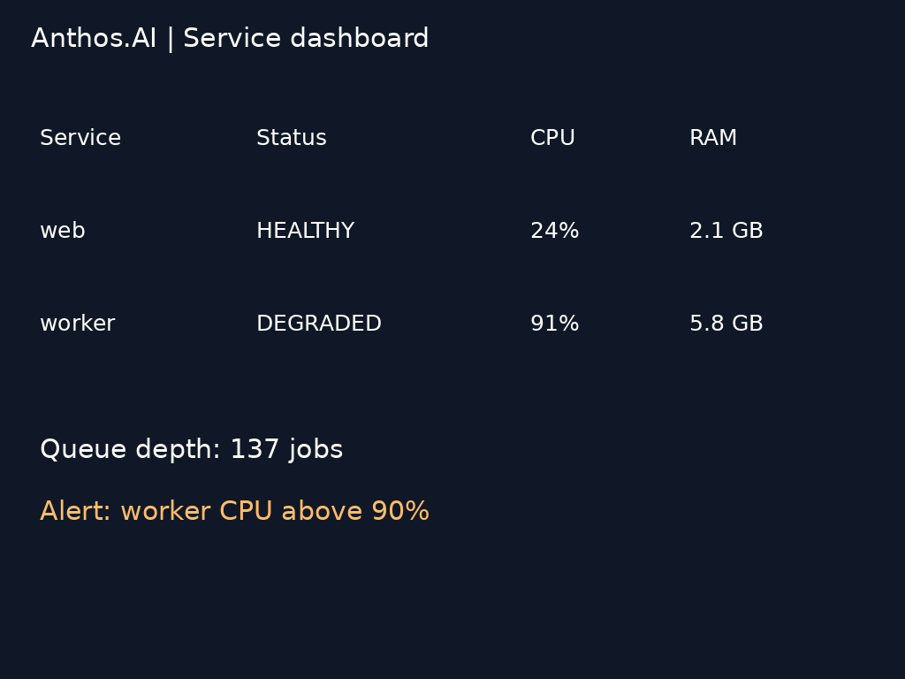

# BC250 automatic model clock and voltage profiles

**Measured and deployed 2026-09-29.** Automatic named clock/voltage selection is active for four API models. Short profile screening, live API validation, boot persistence, and a sustained image thermal retest are recorded below. These settings are specific to this tested board; the short screening does not establish a universal undervolting limit.

## Tested configuration

| Component | Configuration |
|---|---|
| Hardware | One AMD BC250, GFX1013, 40 routed CUs; eight Zen 2 CPU cores / 16 threads |
| Memory | 16 GB shared GDDR6; 512 MiB GPU reservation; Linux MemTotal 15,573,720 KiB |
| GPU memory limits | `amdgpu.gttsize=14750 ttm.pages_limit=3959290 ttm.page_pool_size=3959290` |
| Firmware | P3.00-derived MeiMeiDXE |
| OS / graphics | Ubuntu 24.04.5 LTS, kernel 6.8.0-142-generic, Mesa RADV 25.2.8 |
| Cooling | BIOS-controlled fan curve, stock heatsink and rear spreader with 120 mm fans; fan RPM and ambient temperature unmeasured |
| PSU | 400 W Apevia ITX |
| Temperature policy | 85 C GPU edge cutoff, checked every 500 ms during screening |
| CPU/memory tuning | Unchanged; no CPU overclock, memory timing change, or firmware reflash in this experiment |

## Text and vision screening

Runtime: llama.cpp `4da6337767f973e2b4d0797e5b323d77d8565e4a`, Release build with Vulkan and native CPU optimization. All three models use Q4_K_M language weights and matching F16 vision projectors. Settings: 8,192-token context; batch and ubatch 128; six helper threads; 99 requested GPU layers; flash attention on; one slot; Jinja on; reasoning off; host idle-slot cache disabled. The active prompt cache remains enabled.

Each model stayed loaded while profiles were tested in this order: 1,700 MHz / 925 mV, 1,700 / 912.5, 1,700 / 900, 1,800 / 925. At each profile: one short warm-up, then three alternating dashboard-image and text-generation requests. Temperature 0, seed 42, maximum 256 output tokens. The text prompt asks for at least 400 words, deliberately reaching the output cap for a useful decode sample. Measurements exclude model loading; image preprocessing uses each model default. Profiles were not randomized, no cooldown was inserted, and no wall-power meter was used.

The vision prompt is: `Read the dashboard. Return JSON with keys degraded_service, cpu_percent (integer), ram_gb (number), queue_jobs (integer).` Reference: worker, 91, 5.8, 137.

The text prompt is: `Explain how a database transaction provides atomicity, consistency, isolation and durability. Give concrete examples and continue for at least 400 words.` The warm-up prompt is `Reply only OK.`

Each subsequent profile response was hashed against its corresponding 925 mV baseline response. **All 84 requests completed; all 63 non-baseline responses matched their corresponding baseline byte-for-byte**, including warm-ups. This is short screening evidence, not proof of long-term stability or a broad model-quality evaluation.

| Model | MHz | mV | Workload | Mean response s | Mean decode tok/s | Peak edge C |
|---|---:|---:|---|---:|---:|---:|
| qwen35-9b | 1700 | 925 | vision | 4.637 | 50.64 | 66 |
| qwen35-9b | 1700 | 925 | text | 5.681 | 50.95 | 65 |
| qwen35-9b | 1700 | 912.5 | vision | 4.634 | 50.79 | 68 |
| qwen35-9b | 1700 | 912.5 | text | 5.665 | 50.98 | 68 |
| qwen35-9b | 1700 | 900 | vision | 4.642 | 50.64 | 70 |
| qwen35-9b | 1700 | 900 | text | 5.703 | 50.74 | 69 |
| qwen35-9b | 1800 | 925 | vision | 4.444 | 51.27 | 72 |
| qwen35-9b | 1800 | 925 | text | 5.618 | 51.53 | 71 |
| qwen35-4b | 1700 | 925 | vision | 3.004 | 81.85 | 71 |
| qwen35-4b | 1700 | 925 | text | 3.655 | 82.85 | 72 |
| qwen35-4b | 1700 | 912.5 | vision | 2.978 | 81.79 | 72 |
| qwen35-4b | 1700 | 912.5 | text | 3.619 | 82.42 | 72 |
| qwen35-4b | 1700 | 900 | vision | 3.003 | 81.80 | 72 |
| qwen35-4b | 1700 | 900 | text | 3.647 | 82.75 | 72 |
| qwen35-4b | 1800 | 925 | vision | 2.894 | 83.10 | 73 |
| qwen35-4b | 1800 | 925 | text | 3.587 | 84.23 | 73 |
| gemma3-4b | 1700 | 925 | vision | 2.681 | 90.91 | 72 |
| gemma3-4b | 1700 | 925 | text | 2.976 | 91.01 | 72 |
| gemma3-4b | 1700 | 912.5 | vision | 2.679 | 90.88 | 72 |
| gemma3-4b | 1700 | 912.5 | text | 2.961 | 91.59 | 73 |
| gemma3-4b | 1700 | 900 | vision | 2.676 | 90.66 | 73 |
| gemma3-4b | 1700 | 900 | text | 2.952 | 91.93 | 73 |
| gemma3-4b | 1800 | 925 | vision | 2.569 | 92.59 | 75 |
| gemma3-4b | 1800 | 925 | text | 2.903 | 93.84 | 74 |

The 1,800 MHz text decode improvements over the 1,700 MHz / 925 mV baseline were approximately 1.1% for Qwen3.5-9B, 1.7% for Qwen3.5-4B, and 3.1% for Gemma 3 4B. Lower voltage did not produce a meaningful demonstrated speed improvement at fixed frequency. Because the sequence progressively warmed the board, temperatures cannot be used to estimate undervolting efficiency; power savings were not measured.

## Image screening

Runtime: stable-diffusion.cpp `3f8527a46c54ecf4cb4ed6003da8e8982283c73c`, native Vulkan. Z-Image-Turbo Q5_0 uses Qwen3-4B-Instruct-2507 Q4_K_M, FLUX.1 VAE, Euler 8 steps, discrete scheduler. FLUX.2 Klein 4B Q8_0 uses Qwen3-4B Q4_K_M, FLUX.2 VAE, Euler 4 steps, flux2 scheduler. Both use CFG 1, six threads, diffusion flash attention, VAE tiling and mmap. Seed 42, one image per request, 512 followed by 1024 pixels per profile.

Image prompt: `A photorealistic small home server rack on a wooden workbench, three compact circuit boards beside it, neatly routed blue Ethernet cables, a warm desk lamp, realistic brushed metal, shallow depth of field. A white label clearly reads "Anthos.AI".`

Z-Image completed its first 1024 request at 1,700 MHz / 925 mV in **90.07 s**, peaking at **81 C**. After switching to 900 mV, its 512 image matched the baseline hash, but the following 1024 request reached **85 C** and was stopped. This was a deliberate thermal guard stop, not a demonstrated GPU crash. The planned Z-Image 1,800 MHz test was not run. This sequence does not qualify sustained Z-Image operation at 1,700 MHz under the current fan curve.

FLUX.2 Klein was then screened separately at 1,700 MHz: its 1024 requests completed in **35.28 s at 925 mV** and **34.51 s at 900 mV**, peaking at 73 C and 75 C respectively. Corresponding output hashes matched. Only one 1024 sample per voltage was collected. The first 512 request includes warm-up costs, so its difference from the later 512 request must not be attributed to undervolting. [Raw Klein records](../benchmarks/automatic-profiles/klein-results/trials.json) include the complete sequence.

### Retest with an additional fan

After adding one fan and rebooting, the BIOS fan curve remained in control. Fan model, RPM and ambient temperature were not recorded, so this is a separate cooling condition rather than a controlled fan-efficiency comparison. At 1,700 MHz / 925 mV, Z-Image completed its first 1024 image in **89.42 s**, peaking at **79 C**; the next consecutive 1024 request reached **85 C** and was stopped before completion. The planned third 1024 request and Klein pass in this particular retest were not run. The completed images matched the earlier baseline hashes.

The extra fan did not qualify sustained 1,700 MHz Z-Image operation in this sequence. Its retained selection therefore remains 1,200 MHz / 925 mV; higher-clock image operation needs further cooling qualification. [Retest measurements](../benchmarks/automatic-profiles/image-cooled-results/trials.json) and [thermal trace](../benchmarks/automatic-profiles/image-cooled-results/telemetry.jsonl).

## Automatic profile implementation

| API model | Selected profile | Frequency | Voltage |
|---|---|---:|---:|
| `qwen3.5-9b` | qwen-balanced | 1,700 MHz | 912.5 mV |
| `qwen3.5-4b` | qwen-balanced | 1,700 MHz | 912.5 mV |
| `gemma-3-4b` | gemma-fast | 1,800 MHz | 925 mV |
| `qwen3.5-9b-aggressive` | baseline | 1,700 MHz | 925 mV |
| No loaded model | idle | 1,200 MHz | 925 mV |

The 912.5 mV Qwen setting retains a 12.5 mV margin above the lowest passing short-screening setting. The aggressive variant was not part of the undervolting matrix and keeps its existing baseline. Image weights and settings remain retained for future image-API integration: Z-Image keeps 1,200 MHz / 925 mV; Klein has a 1,700 MHz / 925 mV candidate from short screening. These image models are not advertised as live API endpoints.

A non-root authenticated gateway accepts the existing API key and forwards to a loopback-only llama.cpp router. Before switching, it drains any active response, unloads the previous model, waits for its worker process to exit, and asks a separate root-owned Unix-socket controller to select the next model's named profile. The controller accepts only configured model names; client requests cannot specify clocks, voltages, or commands. Readback is verified before model loading. Requests are serialized across the chip; simultaneous models cannot use different hardware profiles.

The gateway drains upstream work even when the streaming client disconnects. After 60 seconds without inference it unloads the model and selects idle; a subsequent call therefore pays model-loading latency. Response headers expose `X-BC250-Profile`, `X-BC250-Clock-MHz`, and `X-BC250-Voltage-mV`. Authenticated `GET /v1/hardware` reports the selected profile and edge temperature. OpenAI-style chat/completions/embeddings/responses routes and managed model load/unload routes are supported; background inference is rejected because its lifetime would escape the request lock.

At 85 C, a missing sensor, or an unexpected clock change, the controller latches the fault, applies the conservative idle profile, and stops the backend. It does not automatically retry an unstable workload. Requests fail closed if the controller is unavailable. The old fixed-clock service is disabled to prevent competing writers.

## Live API validation

The live checks used the additional-fan condition. Authentication and unknown-model rejection passed. All four API aliases selected their configured hardware profile; concurrent Qwen/Gemma requests were serialized without mixing profiles. The three vision-capable aliases read the synthetic dashboard correctly. Streaming delivered incremental events through its completion marker. After 60 seconds, the model unloaded and hardware returned to 1,200 MHz / 925 mV. The services were also observed starting automatically after a reboot, with eight CPU cores and 40 routed CUs retained.

The 19 inference requests comprise four arithmetic calls, two simultaneous calls, three vision calls, nine longer generations, and one streaming call. The longer prompt was `Explain database transaction isolation levels and give detailed examples of anomalies prevented by each. Write at least 1500 words.` Each generation used temperature 0, seed 42 and a 1,024-token limit. All three repeats for each model reached that limit and produced identical output hashes. This is a stability check, not a comparison against the shorter screening prompts.

| Model | Selected MHz / mV | 1,024-token repeats | Mean decode tok/s |
|---|---|---:|---:|
| qwen3.5-9b | 1700 / 912.5 | 3 | 50.74 |
| qwen3.5-4b | 1700 / 912.5 | 3 | 82.41 |
| gemma-3-4b | 1800 / 925 | 3 | 91.93 |

Peak GPU edge in the two-second live-validation samples was **68 C**. No guard latch occurred during that validation. [Live responses](../benchmarks/automatic-profiles/live-tests.json), [summary and output hashes](../benchmarks/automatic-profiles/live-summary.json), [sampled hardware state](../benchmarks/automatic-profiles/live-telemetry.jsonl), and [final API check after the image test](../benchmarks/automatic-profiles/final-api-check.json).

## Reproduction artifacts

- [Text/vision weight pins and hashes](../benchmarks/automatic-profiles/vision-weight-manifest.json), [image weight pins and hashes](../benchmarks/automatic-profiles/image-weight-manifest.json).
- [Text runtime](../benchmarks/automatic-profiles/text-runtime.json), [image runtime](../benchmarks/automatic-profiles/image-runtime.json), [image commands](../benchmarks/automatic-profiles/image-commands.json).
- [84 screening responses](../benchmarks/automatic-profiles/results/trials.json), [screening telemetry](../benchmarks/automatic-profiles/results/telemetry.jsonl), [partial Z-Image measurements](../benchmarks/automatic-profiles/image-results/trials.json), [Z-Image thermal telemetry](../benchmarks/automatic-profiles/image-results/telemetry.jsonl).
- [Implementation and tests](../scripts/auto-profiles/), including the restricted SMU helper, controller, gateway, unit files, configuration examples, and rollback script.

The public examples use documentation-only network addresses. Replace them with your LAN settings locally; never commit the API key. Installation paths in raw logs are normalized. The synthetic fixture and generated responses do not contain real personal records.

To reproduce screening on a dedicated board with the listed system settings, copy `clock.py`, `bench_support.py`, and `test-profiles.py` to a working directory; place the exact weight files in its `models/` directory and the dashboard PNG in `fixtures/dashboard.png`. Set `LLAMA_SERVER` to the pinned executable. Run the script as root in a transient service with 14 GiB MemoryMax, zero MemorySwapMax, and a 2,400-second RuntimeMaxSec. The generalized script stops the managed inference/profile units and restores the previously active set on exit. These operational changes do not alter its request sequence.

For image screening, also copy `image-commands.json`, set `BC250_IMAGE_ROOT` to the directory containing the pinned `build/bin/sd-server` and `models/` files, and run `test-images.py`; `test-klein.py` isolates the shorter Klein sequence. `test-images-cooled.py` records the added-fan protocol (512 warm-up followed by three planned 1024 requests per model at 1,700 MHz / 925 mV); it requires the new controller/gateway services to be installed. Monitor temperature continuously; do not bypass the cutoff to force completion.

Local behavioral checks: `python3 scripts/auto-profiles/test_gateway.py`. These use fake hardware/backends to test authorization, profile serialization, disconnected streams, asynchronous worker exit, router cleanup retries, and latched thermal fallback. They do not replace live deployment checks.

## Deployment and rollback

The configuration examples use documentation-only addresses (`192.0.2.42` and `192.0.2.0/24`). Set the actual listen address and permitted LAN subnet locally in `gateway.json` and `bc250-api-gateway.service`. Keep the existing API key at `/etc/bc250-ai/api-key`, readable by the dedicated `bc250-ai` service account. The backend requires access to the `render` and `video` groups. The pinned model and projector files must be readable at the paths in `models.ini`.

Install `cpu_power.py` as `/usr/local/libexec/cpu_power.py`. Install `clock.py`, `controller.py`, and `gateway.py` as `/usr/local/libexec/bc250-profile-clock.py`, `/usr/local/libexec/bc250-profile-controller.py`, and `/usr/local/libexec/bc250-api-gateway.py`, owned by root. Install `profiles.json`, `gateway.json`, and `models.ini` under `/etc/bc250-ai/`, also root-owned. Install the two new service files in `/etc/systemd/system/` and `30-profile-backend.conf` in `/etc/systemd/system/bc250-ai.service.d/`. The drop-in moves the existing backend to authenticated loopback port 18080 with automatic model loading disabled; the gateway owns the original API port. The complete equivalent backend unit is included for reference.

Before changing an existing setup, save its original `models.ini` to `/etc/bc250-ai/before-auto-profiles/models.ini`. Stop the existing API and fixed-clock service, then reload systemd. Disable `bc250-gpu-tuning.service` so it cannot compete with the new controller. Enable `bc250-profile-controller.service` and `bc250-api-gateway.service`, then start the controller, backend, and gateway. Wait for `/health` to return 200 before client testing. Root-owned settings can be edited to select any of the documented tested profiles; API clients cannot supply arbitrary frequencies or voltages.

The supplied `rollback.sh` stops and disables the new services, removes the backend drop-in, restores the saved model inventory, and reenables the prior fixed-clock service and original API. It is for the existing-service installation described above, not a fresh installation with a different backend unit. After a thermal latch, inspect cooling and allow the board to cool before restarting the controller, backend, and gateway; a latch is deliberately not cleared by ordinary API requests.

The production fail-safe was also tested without heating the chip: its software threshold was temporarily set to 30 C while the sensor read 43 C. The controller selected 1,200 MHz / 925 mV, stopped the backend, latched the fault, and made `/health` return 503. Restoring the configured 85 C threshold and restarting the services cleared the latch and restored HTTP 200. [Fail-safe check](../benchmarks/automatic-profiles/guard-check.json).
