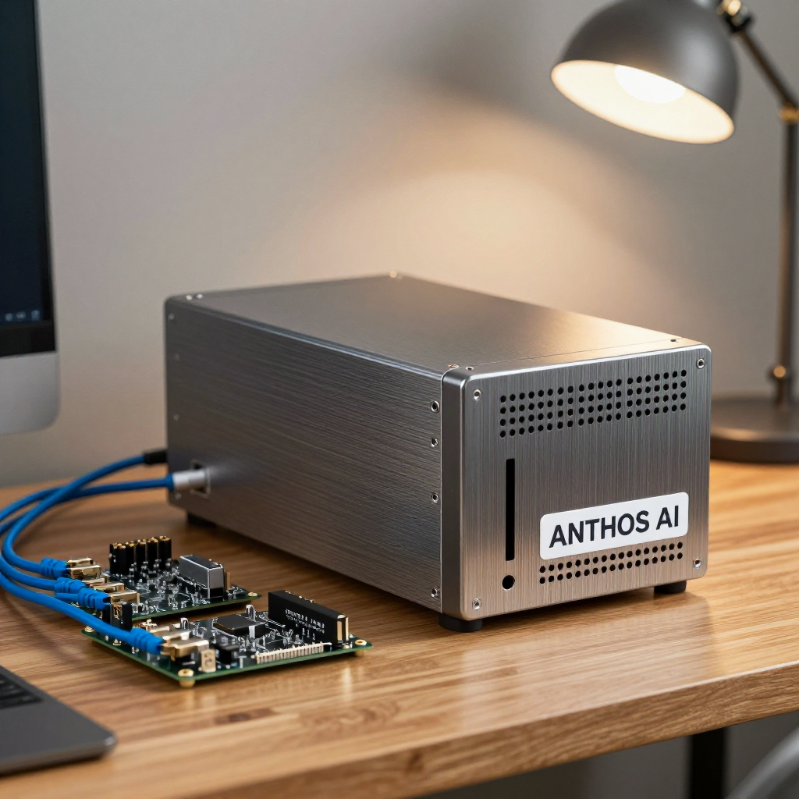
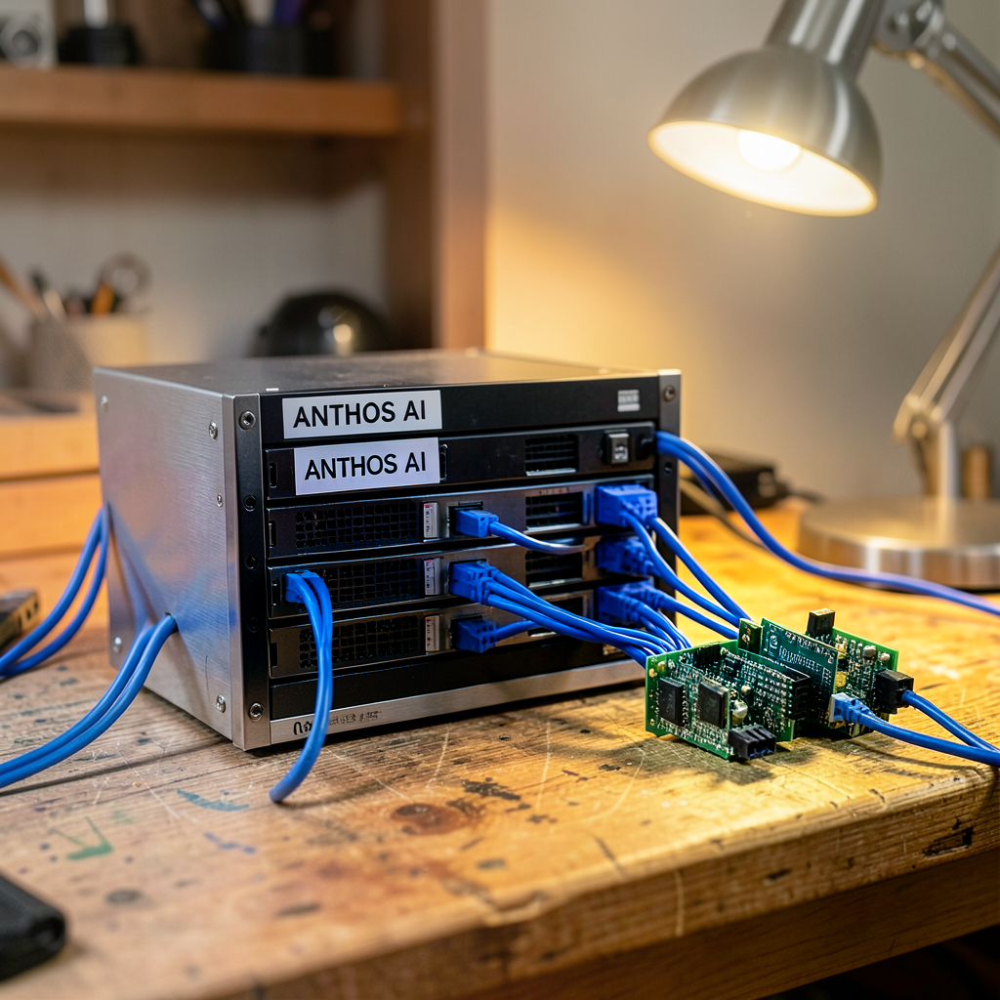
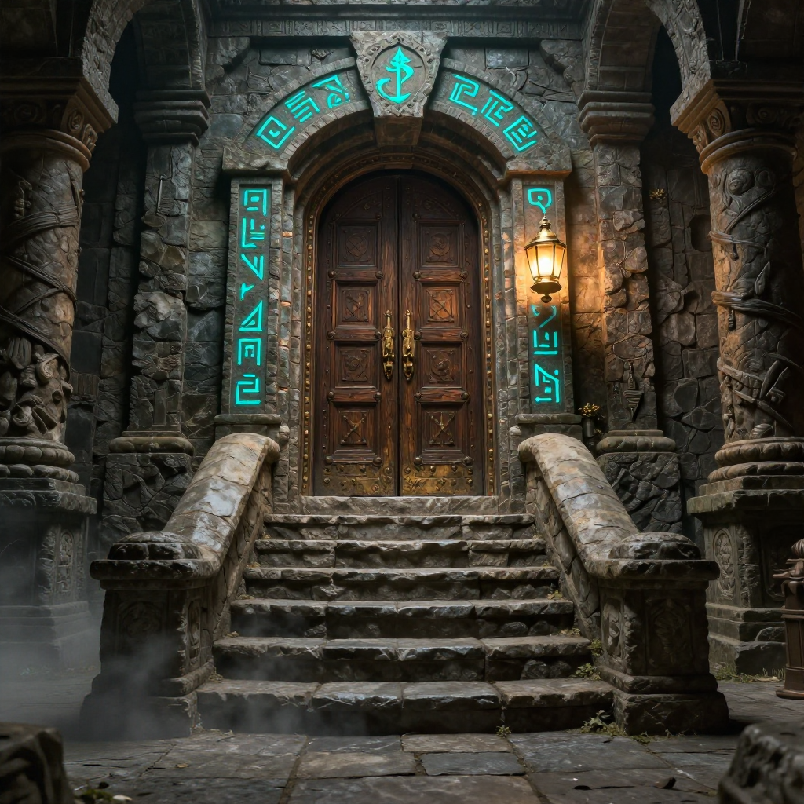
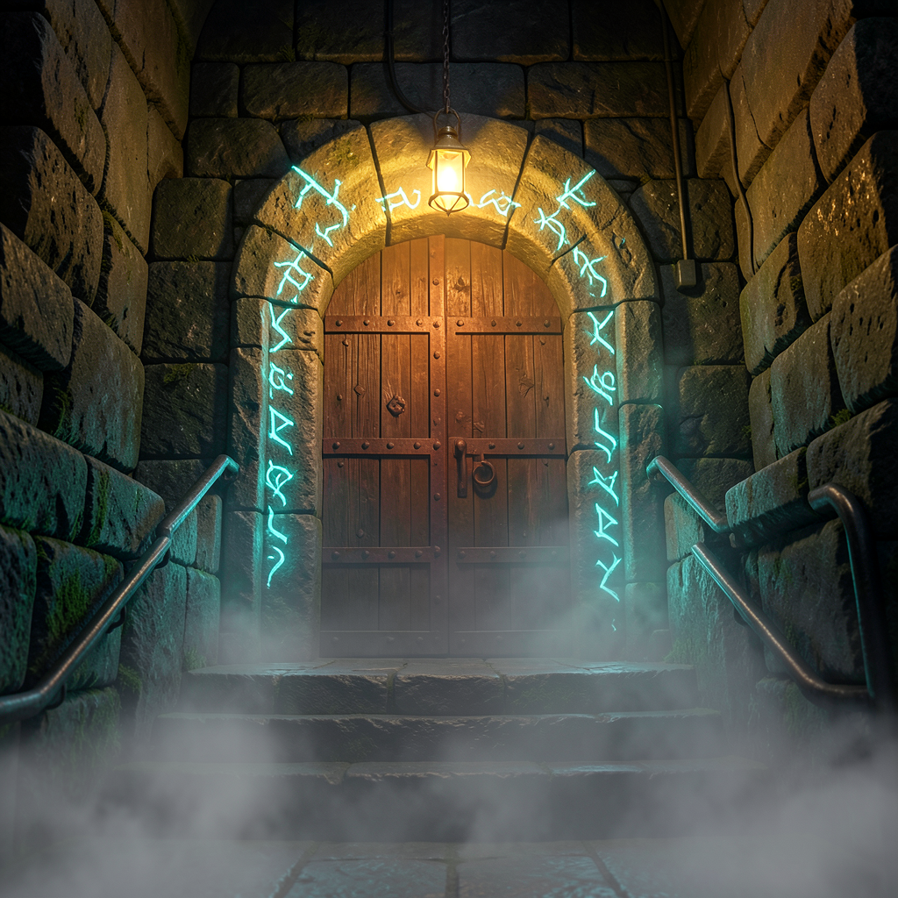

# Z-Image-Turbo vs FLUX.2 Klein on AMD BC250

**Measured on 2026-09-28.** This compares Z-Image-Turbo 6B Q5_0 with the distilled FLUX.2 Klein 4B Q8_0 using native Vulkan inference on one BC250. At 1024×1024, Klein's warmed request time was **2.60× faster** in this configuration. Each model uses its own recommended step count and scheduler; this is a practical model comparison, not a controlled quantization experiment.

## Tested system

| Component | Configuration |
|---|---|
| Board / GPU | AMD BC250, GFX1013; 40 routed CUs, driver topology still reports 24 |
| CPU | Eight Zen 2 cores / 16 threads; six inference helper threads |
| Memory | 16 GB shared GDDR6; 512 MiB firmware GPU reservation; about 14.85 GiB Linux MemTotal |
| Linux GPU limits | `amdgpu.gttsize=14750 ttm.pages_limit=3959290 ttm.page_pool_size=3959290` |
| GPU setting for comparison | **1,200 MHz / VID 100 (925 mV)**, confirmed through SMU before and after every request |
| BIOS | P3.00-derived MeiMeiDXE |
| OS / kernel | Ubuntu 24.04.5 LTS / `6.8.0-142-generic` |
| Driver | Mesa RADV 25.2.8; Vulkan backend reports UMA, FP16, no BF16, subgroup size 32 |
| PSU / cooling | Owner-reported 400 W Apevia ITX; 120 mm fans through stock heatsink and rear spreader; fan RPM and ambient temperature unrecorded |
| Runtime | stable-diffusion.cpp `3f8527a46c54ecf4cb4ed6003da8e8982283c73c` |
| GGML | `89c4413f5da6fb20cc796f16033d37f129be81fd` |
| Build tools | GCC 13.3.0, CMake 3.28.3, shaderc/glslc 2023.8 |

Both models ran sequentially on the same board, Z-Image first and Klein second. A pre-test cooldown targeted 60°C for up to 120 seconds; the first recorded loading temperatures were 61°C for Z-Image and 68°C for Klein. There was no separate cooldown between models. Other inference workers were stopped. The process group had a 14 GiB cgroup memory limit, no cgroup swap, a one-hour outer runtime limit and a ten-minute request timeout. A 500 ms monitor stopped inference at 75°C GPU edge temperature or below 384 MiB host `MemAvailable`.

**Thermal qualification:** sustained Z-Image requests reached the predefined 75°C cutoff at 1,700 MHz (third warmed 512 request) and 1,500 MHz (1024 warm-up). Those attempts were stopped and excluded from the main comparison. The completed 512×512 Z-Image output at seed 42 had an identical PNG SHA-256 at all three tested clocks; this checks one recorded case, not all possible prompts. The complete comparison uses 1,200 MHz for both models. This cutoff is a test policy, not a measured hardware failure temperature. [Thermal trial records](../benchmarks/image-generation/thermal-trials.json)

## Models and settings

| File | Download size | Pinned source |
|---|---:|---|
| `z_image_turbo-Q5_0.gguf` | 4.543 GB | [leejet/Z-Image-Turbo-GGUF](https://huggingface.co/leejet/Z-Image-Turbo-GGUF/tree/c61c0e422dc8b541b7548cf33a4ef8302b0f8085) |
| `flux-2-klein-4b-Q8_0.gguf` | 4.301 GB | [leejet/FLUX.2-klein-4B-GGUF](https://huggingface.co/leejet/FLUX.2-klein-4B-GGUF/tree/3b1f5a9dc3abb32238b053aeb3d823c30afdacbd) |
| `Qwen3-4B-Instruct-2507-Q4_K_M.gguf` | 2.497 GB | [unsloth/Qwen3-4B-Instruct-2507-GGUF](https://huggingface.co/unsloth/Qwen3-4B-Instruct-2507-GGUF/tree/a06e946bb6b655725eafa393f4a9745d460374c9) |
| `Qwen3-4B-Q4_K_M.gguf` | 2.497 GB | [unsloth/Qwen3-4B-GGUF](https://huggingface.co/unsloth/Qwen3-4B-GGUF/tree/22c9fc8a8c7700b76a1789366280a6a5a1ad1120) |
| `ae.safetensors` | 0.335 GB | [Comfy-Org/z_image_turbo](https://huggingface.co/Comfy-Org/z_image_turbo/tree/6fc90a3b1b653e935a0d175e260736de25b84df5) |
| `flux2-vae.safetensors` | 0.336 GB | [Comfy-Org/flux2-klein-4B](https://huggingface.co/Comfy-Org/flux2-klein-4B/tree/5f526678002e43af5551dadb73ce2e8c91b43afe) |

Sizes are decimal GB and describe stored weights, not total runtime memory. The [model manifest](../benchmarks/image-generation/model-manifest.json) contains exact revisions, byte counts, download URLs and SHA-256 hashes. The model repositories are public; no authentication token was used.

| Setting | Z-Image-Turbo | FLUX.2 Klein 4B |
|---|---|---|
| Diffusion quantization | Q5_0 | Q8_0 |
| Text encoder | Qwen3-4B-Instruct-2507 Q4_K_M | Qwen3-4B Q4_K_M |
| VAE | FLUX.1 `ae.safetensors` | FLUX.2 `flux2-vae.safetensors` |
| Sampling | Euler, 8 steps, discrete scheduler | Euler, 4 steps, flux2 scheduler |
| CFG | 1.0 | 1.0 |
| Common runtime settings | Diffusion flash attention, VAE tiling, mmap, six threads, batch size one | Same |

No LoRA, upscaler, refiner, reference image, negative prompt or CPU weight-offload option was used. Automatic backend placement and other runtime defaults were retained. PNG metadata records effective generation settings, including the default CUDA-style RNG algorithm; execution used **Vulkan**, not CUDA.

## Timing results

For each resolution, one same-prompt warm-up with seed 41 preceded three timed requests with seeds 42, 43 and 44. The server stayed loaded. Repeated prompts reused text conditioning. The first 1024 request also warmed the larger graph. Filesystem and driver caches were not cleared, so warm-up timings are not cold-boot measurements.

Seconds per image; means and ranges use the three measured repeats:

| Model | Resolution | Mean request | Request range | Mean sampling | Warm-up request |
|---|---:|---:|---:|---:|---:|
| Z-Image-Turbo Q5_0 | 512×512 | 28.81 | 28.79–28.82 | 26.38 | 38.02 |
| FLUX.2 Klein Q8_0 | 512×512 | 12.88 | 12.86–12.90 | 10.44 | 23.02 |
| Z-Image-Turbo Q5_0 | 1024×1024 | 123.87 | 123.87–123.89 | 110.99 | 124.12 |
| FLUX.2 Klein Q8_0 | 1024×1024 | 47.69 | 47.68–47.72 | 34.77 | 48.64 |

Request time runs from a loopback HTTP POST through receipt and JSON decoding of the PNG response. It includes conditioning when needed, sampling, VAE decoding and image encoding, but excludes server startup, subsequent PNG file writes and clock queries. Sampling times come from the engine log and are not end-to-end times. [Individual measurements](../benchmarks/image-generation/measurements.csv)

## Memory and temperature

Peaks/minima across all completed requests, including warm-ups and the two additional image prompts:

| Model | Peak GTT allocation, GiB | Peak reserved VRAM use, MiB | Minimum host MemAvailable, GiB | Peak GPU edge |
|---|---:|---:|---:|---:|
| Z-Image-Turbo | 6.94 | 476 | 6.78 | 74°C |
| FLUX.2 Klein | 6.65 | 475 | 6.72 | 72°C |

These are sampled driver allocation counters and host memory availability, not independent memory pools to add together. Process RSS and cgroup memory are also recorded in raw results; shared mappings and page-cache accounting make them unsuitable as a single physical-memory total. GPU edge temperature does not measure VRM or memory temperatures. Wall power was not measured.

## Image comparison

The timed prompt is the server scene. Dungeon and hands are additional 1024×1024 requests, seed 42, excluded from the timing means. The same numerical seed does not produce matching noise or compositions across different architectures. The images below are unedited outputs, with generation metadata preserved. This three-prompt visual check is not a broad quality benchmark.

| Prompt | Z-Image-Turbo Q5_0 | FLUX.2 Klein Q8_0 |
|---|---|---|
| Server scene / text, 1024 |  |  |
| Dungeon, 1024 |  |  |
| Hands, 1024 |  |  |

Manual observations at seed 42: both models rendered “ANTHOS AI” legibly at 1024×1024. Klein followed the rack-style scene more closely, while Z-Image produced a single enclosure. Both dungeon samples included cyan runes, a lantern and fog, but showed stairs rising toward the door rather than the requested descending view. Both hand samples had plausible overall anatomy on visual inspection; occlusion prevents treating them as a complete finger-count test. These observations are limited to the published samples.

### Exact prompts

**server**

> A photorealistic small home server rack on a wooden workbench, three compact circuit boards beside it, neatly routed blue Ethernet cables, a warm desk lamp, realistic brushed metal, shallow depth of field. A white label clearly reads "ANTHOS AI".

**dungeon**

> A cinematic fantasy dungeon, an ancient stone stairway descending to an ironbound wooden door, glowing cyan runes carved around the doorway, a single brass lantern casting warm light, mist near the floor, detailed weathered stone, wide composition, no people, no text.

**hands**

> A studio photograph of two human hands holding a blue ceramic mug, anatomically correct fingers, natural skin texture, soft daylight, a plain neutral background, sharp focus on the hands and mug.

## Reproduction

Use the hardware, memory configuration and 1,200 MHz / 925 mV setting above. Stop competing inference workers and any service that would overwrite GPU clocks. The controller below is specific to the tested P3.00 BC250 setup; its no-argument mode reads the clock, `1200` applies the test setting, and `restore` releases overrides.

Build prerequisites are Git, CMake, a C/C++ compiler, Python 3, curl, Vulkan development headers/loader, glslc and SPIR-V headers. From this repository checkout, choose an empty working directory:

```sh
export IMAGE_BENCH_ROOT="$PWD/image-bench-work"
mkdir -p "$IMAGE_BENCH_ROOT"
git clone https://github.com/leejet/stable-diffusion.cpp "$IMAGE_BENCH_ROOT/source"
git -C "$IMAGE_BENCH_ROOT/source" checkout 3f8527a46c54ecf4cb4ed6003da8e8982283c73c
git -C "$IMAGE_BENCH_ROOT/source" submodule update --init --recursive
cmake -S "$IMAGE_BENCH_ROOT/source" -B "$IMAGE_BENCH_ROOT/build" \
  -DSD_VULKAN=ON -DSD_WEBP=OFF -DSD_WEBM=OFF -DCMAKE_BUILD_TYPE=Release
cmake --build "$IMAGE_BENCH_ROOT/build" --target sd-cli sd-server -j4
python3 scripts/download-image-models.py --root "$IMAGE_BENCH_ROOT" \
  --manifest benchmarks/image-generation/model-manifest.json
sudo python3 scripts/bc250-image-clock.py 1200
```

The harness repeats the initial cooldown loop (target 60°C, maximum 120 seconds). Run the [benchmark harness](../scripts/benchmark-images.py) in a bounded systemd unit. It starts loopback-only servers sequentially, saves the images and records per-request telemetry:

```sh
sudo systemd-run --unit=bc250-image-reproduce \
  --property=RuntimeMaxSec=3600 --property=MemoryMax=14G --property=MemorySwapMax=0 \
  --property="ExecStopPost=/usr/bin/python3 $PWD/scripts/bc250-image-clock.py restore" \
  /usr/bin/python3 "$PWD/scripts/benchmark-images.py" \
  --root "$IMAGE_BENCH_ROOT" --mode qualified --clock-mhz 1200 \
  --clock-reader "$PWD/scripts/bc250-image-clock.py"
```

If the unit cannot be launched, release the test override with `sudo python3 scripts/bc250-image-clock.py restore`. The unit stop hook releases it after normal completion, failure or timeout. Results are written under `$IMAGE_BENCH_ROOT/qualified/`. The [download script](../scripts/download-image-models.py) verifies model hashes; [image hashes](../benchmarks/image-generation/image-sha256.json) identify the published outputs. [Runtime manifest](../benchmarks/image-generation/runtime-manifest.json) and [raw request logs/telemetry](../benchmarks/image-generation/) accompany this page.
