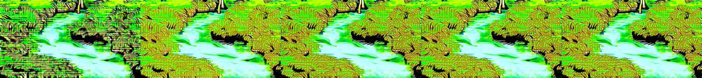

# BC250 video generation: Wan2.1 1.3B versus Wan2.2 5B

Both configurations generated valid video files, but sampled outputs show substantial quality and prompt-adherence problems. Wan2.2 was faster at 480p (590.06 s versus 990.50 s); this is not a quality endorsement.

Measured 2026-09-29 on one BC250. The comparison tests two text-to-video configurations with identical prompts and output dimensions. The larger model uses quantized diffusion weights; this is a comparison of tested configurations, not a controlled comparison of parameter count or precision alone.

## Tested system

| Component | Setting |
|---|---|
| APU | AMD BC250, GFX1013, eight Zen 2 cores / 16 threads, 40 routed GPU CUs |
| Shared memory | 16 GB GDDR6; 512 MiB GPU reservation; MemTotal:       15573716 kB |
| GPU memory parameters | `amdgpu.gttsize=14750 ttm.pages_limit=3959290 ttm.page_pool_size=3959290` |
| Firmware | P3.00-derived MeiMeiDXE |
| OS / graphics | Ubuntu 24.04.5, 6.8.0-142-generic, RADV 25.2.8 |
| GPU / CPU policy | 1200 MHz / 925 mV; CPU performance governor, six helper threads |
| Cooling / PSU | Stock heatsink and rear spreader, 120 mm fans plus one additional fan, BIOS fan curve; 400 W Apevia ITX PSU |
| Measurement limits | Ambient temperature, fan RPM and wall power unmeasured |
| Runtime | stable-diffusion.cpp `3f8527a46c54ecf4cb4ed6003da8e8982283c73c`, clean source checkout, Vulkan Release build |
| Encoding | ffmpeg version 6.1.1-3ubuntu5 Copyright (c) 2000-2023 the FFmpeg developers |

Build options: `-DSD_VULKAN=ON -DSD_WEBP=OFF -DSD_WEBM=OFF -DCMAKE_BUILD_TYPE=Release`. Model files, full revision pins, sizes and SHA-256 values are in the [weight manifest](../benchmarks/video-generation/weights.json). Both configurations use UMT5-XXL Q4_K_M; each uses its own original Wan VAE. GPU detection and internal buffer information are preserved in the individual runtime logs.

## Protocol

Each model first generated a 256×160, 17-frame, four-step validation clip. These previews were mechanically valid but heavily distorted and are not representative quality samples. The main tests generated 33 frames at 512×288: the car prompt twice with the same seed, then the waterfall prompt once. Each model then generated one 832×480 car clip. Ten process launches total; all output playback rates are 16 fps. A 33-frame file lasts 2.0625 seconds. No audio is generated.

Main settings: Euler sampler, discrete scheduler, 20 steps, CFG 6, flow shift 3, seed 42, diffusion flash attention, mmap, CPU weight staging (`--offload-to-cpu`), spatial VAE tiling at its 256×256 default and temporal VAE tiling. Computation uses Vulkan. Each trial starts a new `sd-cli` process; operating-system file caches are retained. These repeats do not measure a resident server's warm-context performance. Tests are sequential, not randomized.

Car prompt: `A small red toy car drives smoothly from left to right across a wooden table. The camera stays fixed. Soft daylight, realistic textures, continuous clear motion.`

Waterfall prompt: `A small waterfall flows continuously over mossy rocks in a green forest. Leaves sway gently in the breeze. The camera slowly moves forward. Natural daylight, realistic water, smooth coherent motion.`

Negative prompt: `blurry, low quality, distorted, static image, flickering, subtitles, watermark, text`.

Before each launch, the GPU cools to at most 55°C. A 0.5-second monitor stops the child at 85°C GPU edge, below 384 MiB host available memory, or after 3600 seconds. The transient benchmark service has a 14 GiB memory limit and no swap. The API and automatic profile controller are stopped during testing and restored afterward so they cannot compete for shared memory or write GPU clocks.

## Measurements

Process time includes model setup, conditioning, sampling, VAE decoding and AVI writing. It excludes cooldown and subsequent MP4 encoding. Sampling and decoding are runtime-reported stage timings. Generated fps is validated frames divided by process seconds; it is not the playback rate. RSS is peak sampled process resident memory, not isolated GPU VRAM usage. All temperature and memory peaks are sampled rather than continuously measured maxima.

| Model | Resolution | Prompt | Process s | Sampling s | Decode s | Generated fps | Peak RSS GiB | Peak edge °C |
|---|---|---|---:|---:|---:|---:|---:|---:|
| Wan2.1 T2V 1.3B FP16 | 512×288 | car  | 274.94 | 196.34 | 72.53 | 0.120 | 6.56 | 74 |
| Wan2.1 T2V 1.3B FP16 | 512×288 | car repeat | 276.43 | 196.49 | 72.89 | 0.119 | 6.64 | 74 |
| Wan2.1 T2V 1.3B FP16 | 512×288 | water  | 275.43 | 196.33 | 72.91 | 0.120 | 6.65 | 75 |
| Wan2.2 TI2V 5B Q4_K_M | 512×288 | car  | 266.40 | 154.95 | 105.54 | 0.124 | 7.87 | 72 |
| Wan2.2 TI2V 5B Q4_K_M | 512×288 | car repeat | 261.89 | 150.93 | 104.40 | 0.126 | 7.95 | 72 |
| Wan2.2 TI2V 5B Q4_K_M | 512×288 | water  | 262.47 | 150.88 | 104.83 | 0.126 | 7.85 | 72 |
| Wan2.1 T2V 1.3B FP16 | 832×480 | car  | 990.50 | 864.77 | 119.54 | 0.033 | 6.76 | 75 |
| Wan2.2 TI2V 5B Q4_K_M | 832×480 | car  | 590.06 | 410.21 | 173.63 | 0.056 | 8.00 | 77 |

### Consecutive runs

- Wan2.1 T2V 1.3B FP16: 274.94 → 276.43 seconds; decoded frame sequences matched exactly.
- Wan2.2 TI2V 5B Q4_K_M: 266.40 → 261.89 seconds; decoded frame sequences matched exactly.

The sample counts are too small to infer a general speed advantage from minor differences. Full per-trial metadata and temperature/memory traces are in [raw records](../benchmarks/video-generation/); [derived timings and repeat comparisons](../benchmarks/video-generation/analysis.json) preserve the calculation inputs.

## Output inspection

The contact sheets show decoded frames 0, 8, 16, 24 and 32. These observations assess sampled frames and prompt adherence; they are not a formal perceptual benchmark or a complete full-speed playback evaluation. Every file was checked for expected dimensions, frame count, duration and playback rate. More than one unique decoded frame establishes change, not useful motion or visual quality.

### Wan2.1 T2V 1.3B FP16 — car-1

[Download/play MP4](../assets/video-generation/wan21-car-1/clip.mp4)


Recognizable toy car moves left-to-right late in the clip. Car is black rather than requested red; first sampled frames are mostly empty table. Bright/overexposed tabletop.

### Wan2.1 T2V 1.3B FP16 — water-1

[Download/play MP4](../assets/video-generation/wan21-water-1/clip.mp4)


Water and mossy rocks are recognizable, but frames are strongly oversaturated with fluorescent green colors and repeated contour/texture artifacts. Sampled framing changes little. This is not a clean photorealistic result.

### Wan2.1 T2V 1.3B FP16 — 480p

[Download/play MP4](../assets/video-generation/wan21-480p/clip.mp4)


Recognizable toy vehicles move rightward across an orange/brown tabletop. Sampled frames are substantially clearer than the lower-resolution outputs, but there are two blue/black cars instead of the requested single red car. Prompt color and object count are not followed.

### Wan2.2 TI2V 5B Q4_K_M — car-1

[Download/play MP4](../assets/video-generation/wan22-car-1/clip.mp4)


Severely washed-out yellow/orange imagery with repeated block-like forms; no clear red toy car in the sampled frames. Mechanically valid video but poor prompt adherence and visibly unusable result for the requested scene.

### Wan2.2 TI2V 5B Q4_K_M — water-1

[Download/play MP4](../assets/video-generation/wan22-water-1/clip.mp4)


Severely bright and oversaturated green/white scene with dense repeated texture and grid-like artifacts. Forest/water elements are suggested, but output is not clean photorealistic video and should not be presented as a successful quality result.

### Wan2.2 TI2V 5B Q4_K_M — 480p

[Download/play MP4](../assets/video-generation/wan22-480p/clip.mp4)


A pale toy car and small table are recognizable, but the scene is strongly washed out, the car is not red, and sampled positions show little apparent movement. All source frames differ numerically, which does not establish meaningful motion.


## Matched CPU decoder control

An additional Wan2.1 waterfall run used the same 512×288, 33-frame, 20-step settings and seed, changing only the VAE backend with `--backend vae=cpu`. Diffusion still ran on Vulkan. This brings the total to 11 successful process launches, including the two smoke tests.

| VAE backend | Process seconds | Sampling seconds | Decode seconds | Peak GPU edge °C |
|---|---:|---:|---:|---:|
| Vulkan | 275.43 | 196.33 | 72.91 | 75 |
| CPU | 1375.65 | 199.62 | 1167.71 | 83 |

CPU decoding took about 16.0 times as long, and total generation took about 5.0 times as long. The CPU control still shows fluorescent green oversaturation and repeated contour/texture artifacts in the sampled frames. It did not visibly repair the output, so this test does not support a Vulkan-VAE-only explanation. The underlying cause remains unresolved; these results characterize this pinned runtime and configuration, not the models' best achievable quality.

[CPU-control MP4](../assets/video-generation/wan21-water-cpu-vae/clip.mp4) · [Control records](../benchmarks/video-generation/diagnostic-results/)



Reproduce with `diagnostic.py` instead of `benchmark.py`, a distinct unit name `bc250-video-diagnostic`, and `RuntimeMaxSec=4500`. Retain the same memory limits and `ExecStopPost` restoration command shown below. The control's per-trial limit is 3600 seconds. All 11 runs stayed below the 85°C edge cutoff; the control peaked at 83°C. API service restoration and a subsequent authenticated inference were verified after testing.

## Reproduction

Place the pinned Vulkan `sd-cli` at `/opt/bc250-mod-prep/image-bench/build/bin/sd-cli` and copy the [benchmark scripts](../scripts/video-generation/) plus `weights.json` into `/opt/bc250-mod-prep/video-bench/`. Install FFmpeg with H.264 encoding support. Run `download.py` to fetch pinned weights and verify their exact sizes and hashes. At least 12 GB is needed for these weights, plus runtime and output space. The scripts use the existing restricted `/usr/local/libexec/bc250-profile-clock.py` helper for the tested GPU setting; install the supplied `clock.py` at that path, owned by root. Its accompanying license is included.

Build the pinned runtime with its pinned submodules:

```sh
git clone --recursive https://github.com/leejet/stable-diffusion.cpp source
git -C source checkout 3f8527a46c54ecf4cb4ed6003da8e8982283c73c
git -C source submodule update --init --recursive
cmake -S source -B build -DSD_VULKAN=ON -DSD_WEBP=OFF -DSD_WEBM=OFF -DCMAKE_BUILD_TYPE=Release
cmake --build build --parallel 6
```

Run the prepared benchmark with the tested service limits:

```sh
sudo systemd-run --unit=bc250-video-benchmark \
  --property=MemoryMax=14G --property=MemorySwapMax=0 \
  --property=RuntimeMaxSec=14400 --property=TimeoutStopSec=30 \
  --property='ExecStopPost=/usr/bin/python3 /opt/bc250-mod-prep/video-bench/restore.py' \
  /usr/bin/python3 /opt/bc250-mod-prep/video-bench/benchmark.py
```

The orchestration expects the existing `bc250-profile-controller`, `bc250-ai`, and `bc250-api-gateway` systemd services. It saves their active states and the original CPU governors, stops them, and restores them through `restore.py` in a `finally` block. Configure `restore.py` as `ExecStopPost` as well, with `MemoryMax=14G`, `MemorySwapMax=0`, `RuntimeMaxSec=14400`, and `TimeoutStopSec=30`. Read the scripts before adapting them to another service layout. The full arguments for every invocation are retained in its `command.json`.

Videos are encoded from the original AVI to H.264 MP4 using CRF 18, YUV420p and fast-start, with metadata stripped. MP4 encoding times are recorded separately. Frame hashes refer to decoded original AVI frames; MP4 SHA-256 values refer to the downloadable artifacts. Model loading, resolution, step count, quantization and VAE tiling all affect results; these measurements do not establish longer-video capacity or a model-quality ranking beyond the two prompts tested.
