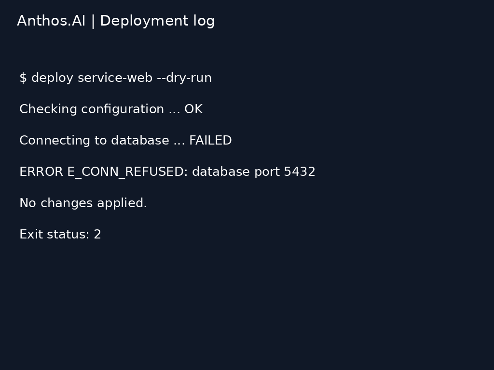
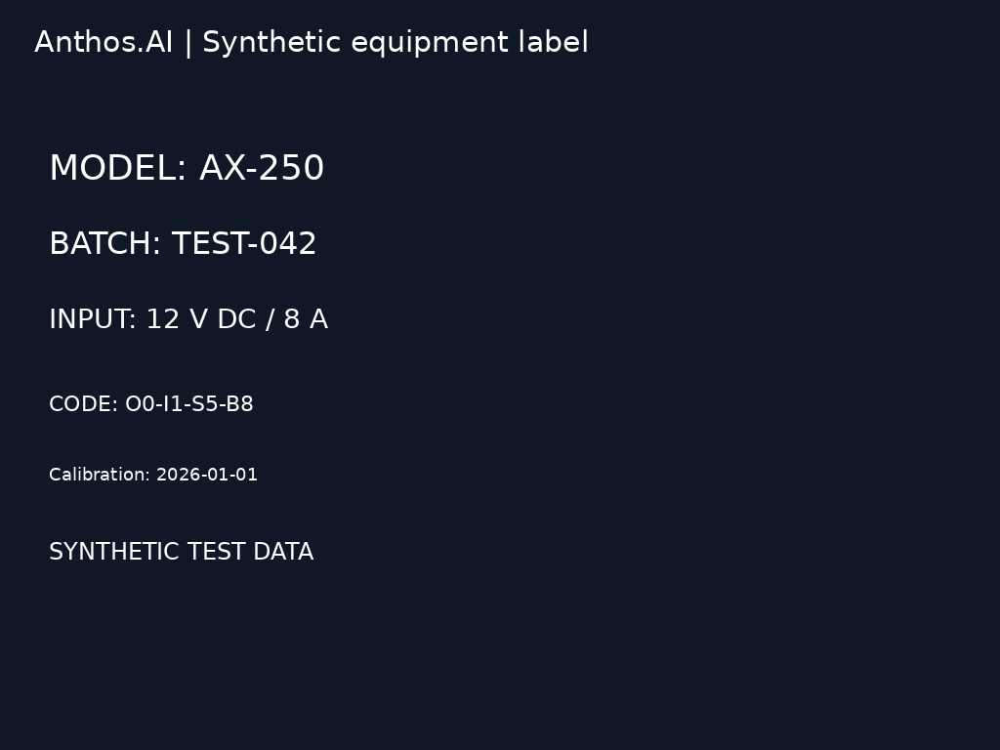
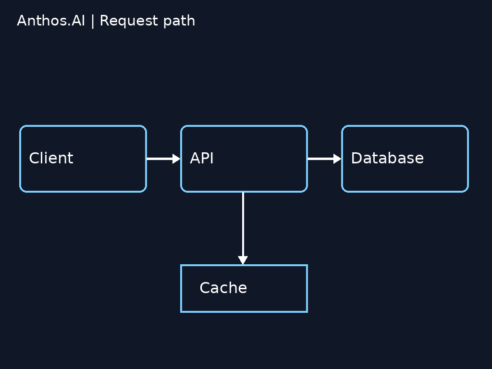
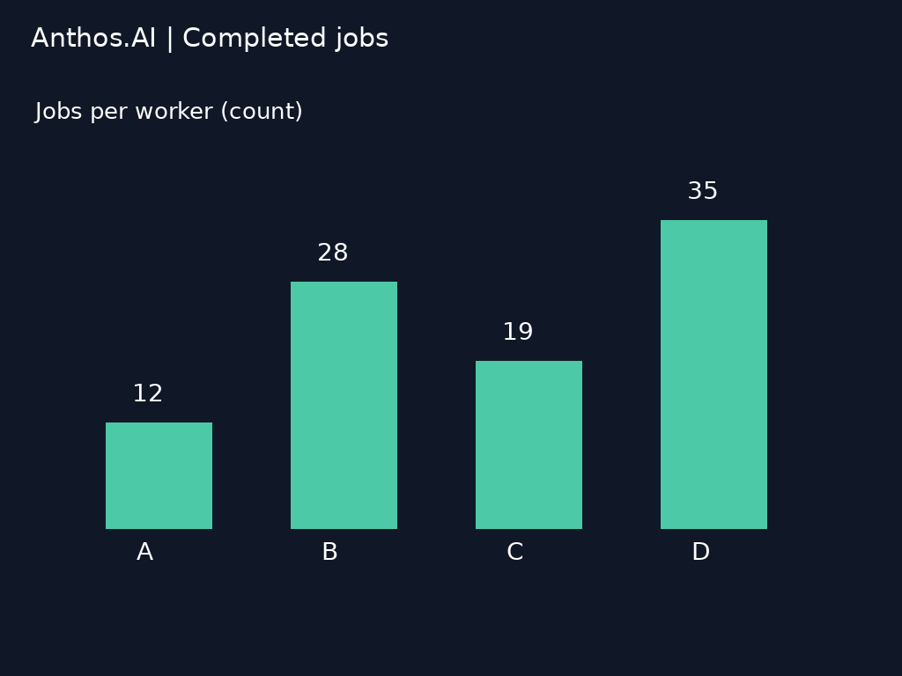
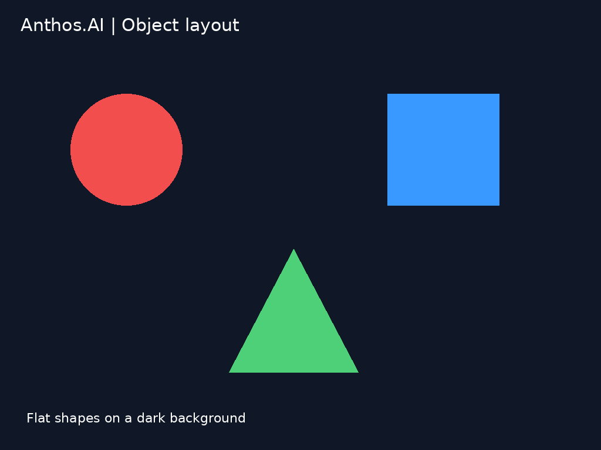

# Qwen3.5-9B vs Qwen3.5-4B vs Gemma 3 4B: BC250 vision benchmark

**Measured 2026-09-29.** All three Q4_K_M models completed 21 requests each using native Vulkan on one AMD BC250. The existing optimized Qwen3.5-9B was tested first, followed by Qwen3.5-4B and Gemma 3 4B. The 9B model produced the most reliable structured responses on these six synthetic fixtures. Gemma decoded fastest; Qwen3.5-4B provided the faster Qwen alternative. These are small, task-specific measurements, not a general vision leaderboard.

## System and runtime

| Component | Measured configuration |
|---|---|
| Board | AMD BC250 / GFX1013; 40 routed CUs (driver topology still reports 24) |
| CPU | Eight Zen 2 cores / 16 threads; six inference helper threads |
| Memory | 16 GB shared GDDR6; 512 MiB firmware GPU reservation; Linux MemTotal 15,573,720 KiB |
| GPU limits | `amdgpu.gttsize=14750 ttm.pages_limit=3959290 ttm.page_pool_size=3959290` |
| GPU clock | 1,700 MHz, VID 100 / 925 mV, SMU-checked before and after every request |
| Firmware | P3.00-derived MeiMeiDXE |
| OS / kernel / driver | Ubuntu 24.04.5 LTS / 6.8.0-142-generic / Mesa RADV 25.2.8 |
| PSU / cooling | 400 W Apevia ITX; 120 mm fans through stock heatsink and rear spreader; ambient temperature and fan RPM unrecorded |
| Runtime | llama.cpp `4da6337767f973e2b4d0797e5b323d77d8565e4a`, existing Release build, GGML_VULKAN=ON, GGML_NATIVE=ON |

The original 9B weights were reused and their SHA-256 verified. The matching F16 vision projector was added for this test; the existing production API configuration was not altered. All three language models and projectors used the same runtime, GPU-offload defaults, 8,192-token context, batch/ubatch 128, six threads, 99 requested GPU layers, flash attention, one slot, Jinja, and reasoning disabled. Host idle-slot cache was disabled with `--cache-ram 0`; active-slot prompt caching remained enabled. No image-min/max-token override was set, so each model used its own default image preprocessing. Equal input images do not imply equal visual token counts. The Qwen runtime warns that grounding tasks may need at least 1,024 image tokens; that override was not applied in this baseline. Higher image-token budgets and constrained JSON output are possible follow-up tests, not measured improvements here.

The harness ran one loopback-only server at a time, stopping the normal inference service during measurement and restoring it afterward. Limits: 14 GiB cgroup memory, no cgroup swap, 90-minute outer timeout, 300-second request timeout. Telemetry sampled every 500 ms; cutoff was 75 C GPU edge or less than 384 MiB host MemAvailable. This cutoff is a test policy, not a measured failure temperature. No guard events, OOM events, or request truncations occurred. There was no separate cooldown between models.

## Weights

| Model / companion file | Size (decimal GB) | Pinned source |
|---|---:|---|
| `Qwen3.5-9B-Q4_K_M.gguf` | 5.681 | [unsloth/Qwen3.5-9B-GGUF](https://huggingface.co/unsloth/Qwen3.5-9B-GGUF/tree/3885219b6810b007914f3a7950a8d1b469d598a5) |
| `mmproj-F16.gguf` | 0.918 | [unsloth/Qwen3.5-9B-GGUF](https://huggingface.co/unsloth/Qwen3.5-9B-GGUF/tree/3885219b6810b007914f3a7950a8d1b469d598a5) |
| `Qwen3.5-4B-Q4_K_M.gguf` | 2.741 | [unsloth/Qwen3.5-4B-GGUF](https://huggingface.co/unsloth/Qwen3.5-4B-GGUF/tree/e87f176479d0855a907a41277aca2f8ee7a09523) |
| `mmproj-F16.gguf` | 0.672 | [unsloth/Qwen3.5-4B-GGUF](https://huggingface.co/unsloth/Qwen3.5-4B-GGUF/tree/e87f176479d0855a907a41277aca2f8ee7a09523) |
| `gemma-3-4b-it-Q4_K_M.gguf` | 2.490 | [ggml-org/gemma-3-4b-it-GGUF](https://huggingface.co/ggml-org/gemma-3-4b-it-GGUF/tree/d0976223747697cb51e056d85c532013931fe52e) |
| `mmproj-model-f16.gguf` | 0.851 | [ggml-org/gemma-3-4b-it-GGUF](https://huggingface.co/ggml-org/gemma-3-4b-it-GGUF/tree/d0976223747697cb51e056d85c532013931fe52e) |

Exact byte counts and hashes: [weight manifest](../benchmarks/vision/download-manifest.json). Runtime and baseline hash: [runtime manifest](../benchmarks/vision/runtime-manifest.json).

## Method

Six synthetic 1024x768 PNG fixtures, generated with Pillow and DejaVu Sans, contain no real screenshots, people, account identifiers, network addresses, or private system data. Anthos.AI is the only project branding. PNGs contain no personal metadata. The fixed fixtures, exact prompts, expected answers, and image hashes are included below and in [cases.json](../benchmarks/vision/cases.json).

Each fixture was submitted three consecutive times with identical input and no intervening request: first encounter, repeat 2, repeat 3. Temperature 0, seed 42, maximum 256 output tokens, streaming enabled, no forced JSON schema. The first request includes image processing and any needed graph warm-up, but excludes model loading; filesystem/driver caches were not cleared. Warm repeats reuse active-slot prompt state. Afterwards, a separate three-turn dashboard conversation tests follow-up arithmetic and absent-information handling. Total: 18 fixture requests plus 3 conversation requests per model, 63 requests overall.

Wall time is the full loopback HTTP request through stream completion. TTFT here means time until the first nonempty content delta, not a role-only stream event. Decode tok/s is the server-reported `predicted_per_second`; it excludes image/prompt processing. Values are arithmetic means across the indicated requests. Different tokenizers and response lengths make cross-model tok/s an imperfect measure of useful work; wall time and answer quality should be read alongside it.

## Timing results

| Model | First image request, mean s (n=6) | First TTFT, mean s | Warm request, mean s (n=12) | Warm TTFT, mean s | First decode tok/s | Warm decode tok/s |
|---|---:|---:|---:|---:|---:|---:|
| Qwen3.5-9B | 4.82 | 3.76 | 1.58 | 0.52 | 50.66 | 50.76 |
| Qwen3.5-4B | 3.19 | 2.40 | 1.27 | 0.49 | 81.47 | 81.56 |
| Gemma 3 4B | 2.79 | 2.13 | 1.29 | 0.64 | 90.27 | 90.44 |

Repeated requests mainly improved input-processing latency, not decode tok/s. For example, Qwen3.5-9B fell from 4.82 s to 1.58 s per request while decode throughput stayed near 50.7 tok/s. These short answers do not measure sustained long-generation throughput.

## Structured answer accuracy

The scorer removes outer Markdown code fences, parses JSON, then checks the requested fields. String comparison ignores case and repeated whitespace. For shape descriptions, a `{color, shape}` object is accepted as equivalent to a color-and-shape string because the prompt did not constrain that representation. Invalid JSON or a top-level array instead of an object receives no extractable-field points for that response. This measures structured usability as well as recognition; it must not be interpreted as a pure visual-perception score. No retries, repairs, or schema-constrained regeneration were used.

| Fixture | Available fields | Qwen3.5-9B | Qwen3.5-4B | Gemma 3 4B |
|---|---:|---:|---:|---:|
| dashboard | 4 | 4 | 4 | 4 |
| terminal | 4 | 4 | 4 | 4 |
| ocr | 5 | 4 | 4 | 4 |
| diagram | 3 | 3 | 0 | 1 |
| chart | 4 | 4 | 4 | 0 |
| spatial | 4 | 4 | 4 | 4 |
| **First-pass total** | **24** | **23** | **20** | **17** |

All three repeats received the same field scores. Repeats are not independent accuracy samples. Manual inspection of the unedited responses shows:

- All three read the dashboard and terminal fields correctly and described the spatial layout correctly.
- All three misread the label code `O0-I1-S5-B8` as `00-I1-S5-B8`. Other label fields were correct.
- Qwen3.5-9B correctly returned the diagram and chart in the requested structure.
- Qwen3.5-4B correctly identified all diagram edges but wrapped two identical answer objects in a JSON array. Ignoring that structural error, it identified the same 23/24 facts as the 9B model. Its nested color/shape objects are accepted by the scorer.
- Gemma identified the main diagram path, but returned `["API", "Cache"]` as the branch source and `["Cache"]` as the target, instead of a single source and target label.
- Gemma correctly identified worker D and count 35 in the chart, but emitted `12 + 28 + 19 + 35` and `35 - 12` as JSON values instead of computed integers. Those expressions make the entire response invalid JSON; the structured scorer consequently awards that response zero.

### Follow-up conversation

All models first reread the dashboard correctly. The next question asked for the CPU percentage-point difference between worker (91%) and web (24%), expecting **67**. The final question asked whether a GPU temperature appeared, expecting **NO**.

| Model | CPU difference answer | Wall s | Absent-temperature answer | Wall s |
|---|---|---:|---|---:|
| Qwen3.5-9B | `67` | 1.61 | `NO` | 1.38 |
| Qwen3.5-4B | `67` | 1.47 | `NO` | 1.29 |
| Gemma 3 4B | `97` | 1.13 | `NO` | 1.17 |

All models avoided inventing the missing temperature. Gemma made an arithmetic/reading error on the CPU follow-up. Short one-word answers are unsuitable for comparing stable decode throughput.

## Resource measurements

| Model | Load-to-ready s | Initial edge C | Peak edge C | Peak GPU GTT GiB | Minimum host available GiB |
|---|---:|---:|---:|---:|---:|
| Qwen3.5-9B | 12.08 | 57 | 67 | 6.42 | 6.97 |
| Qwen3.5-4B | 8.02 | 63 | 68 | 3.92 | 9.45 |
| Gemma 3 4B | 8.03 | 64 | 68 | 3.65 | 9.79 |

Allocation counters are not separate physical memory pools and must not be summed with RSS or host memory usage. Peak/minimum values cover loading and all requests, not just warm repeats.

## Fixtures, prompts, and reference answers

### dashboard


**Prompt:** Read the dashboard. Return JSON with keys degraded_service, cpu_percent (integer), ram_gb (number), queue_jobs (integer).

**Reference:**

```json
{
  "degraded_service": "worker",
  "cpu_percent": 91,
  "ram_gb": 5.8,
  "queue_jobs": 137
}
```

### terminal



**Prompt:** Read this terminal screenshot. Return JSON with keys error_code, database_port (integer), exit_status (integer), changes_applied (boolean).

**Reference:**

```json
{
  "error_code": "E_CONN_REFUSED",
  "database_port": 5432,
  "exit_status": 2,
  "changes_applied": false
}
```

### ocr



**Prompt:** Transcribe the equipment label. Return JSON with keys model, batch, input, code, calibration. Preserve punctuation and distinguish similar characters.

**Reference:**

```json
{
  "model": "AX-250",
  "batch": "TEST-042",
  "input": "12 V DC / 8 A",
  "code": "O0-I1-S5-B8",
  "calibration": "2026-01-01"
}
```

### diagram



**Prompt:** Read the arrow directions. Return JSON with keys main_path (array of three labels in order), branch_source, branch_target.

**Reference:**

```json
{
  "main_path": [
    "Client",
    "API",
    "Database"
  ],
  "branch_source": "API",
  "branch_target": "Cache"
}
```

### chart



**Prompt:** Read the bar chart. Return JSON with keys highest_worker, highest_count (integer), total_jobs (integer), difference_D_A (integer).

**Reference:**

```json
{
  "highest_worker": "D",
  "highest_count": 35,
  "total_jobs": 94,
  "difference_D_A": 23
}
```

### spatial



**Prompt:** Describe the layout. Return JSON with keys top_left, top_right, bottom_center, circle_count (integer). Use color and shape names.

**Reference:**

```json
{
  "top_left": "red circle",
  "top_right": "blue square",
  "bottom_center": "green triangle",
  "circle_count": 1
}
```

## Reproduction

Use a dedicated BC250 configured as in the system table. The exact recorded commands are available below. The harness expects the normal chat service to be named `bc250-ai.service` and SMU readback using [bc250-gpu-clock.py](../scripts/bc250-gpu-clock.py) installed at `/usr/local/libexec/bc250-gpu-clock.py`; adapt those two operational hooks if using another setup. It expects the GPU at 1,700 MHz; it does not change clocks or firmware. Stop other inference workloads first.

Build the pinned llama.cpp commit with `cmake -S . -B build -DCMAKE_BUILD_TYPE=Release -DGGML_VULKAN=ON -DGGML_NATIVE=ON`, then `cmake --build build --target llama-server -j4`. The tested binary hash is in the runtime manifest; compiler and Vulkan-library versions can affect performance.

From this repository root, prepare an isolated directory (substitute the absolute path to the built server):

```bash
mkdir -p vision-bench-work/fixtures
cp scripts/benchmark-vision.py vision-bench-work/benchmark.py
cp scripts/download-vision-models.py vision-bench-work/download.py
cp scripts/score-vision.py vision-bench-work/score.py
cp benchmarks/vision/{download-manifest,cases}.json vision-bench-work/
cp assets/vision/*.png vision-bench-work/fixtures/
python3 vision-bench-work/download.py
sudo systemd-run --unit=bc250-vision-reproduce --wait --pipe \
  --property=MemoryMax=14G --property=MemorySwapMax=0 \
  --property=RuntimeMaxSec=5400 \
  --property="ExecStopPost=/usr/bin/systemctl start bc250-ai.service" \
  --setenv=LLAMA_SERVER=/absolute/path/to/llama-server \
  /usr/bin/python3 "$PWD/vision-bench-work/benchmark.py"
python3 vision-bench-work/score.py
```

The downloader pins revisions and verifies sizes and SHA-256. It can reuse existing files with the exact expected names and hashes. Use the committed PNGs for byte-identical inputs. To regenerate instead, place [make-vision-fixtures.py](../scripts/make-vision-fixtures.py) in the work directory and run it with Pillow and `/usr/share/fonts/truetype/dejavu/DejaVuSans.ttf`; PNG bytes can vary with library/font versions.

## Raw results

Paths in recorded commands and logs are normalized to `BENCH_ROOT`, `MODEL_ROOT`, and `LLAMA_ROOT`. No credentials, personal home paths, device hostnames, or private network addresses are included. Answers and numerical measurements are otherwise unedited.

- Qwen3.5-9B: [all 21 answers and timings](../benchmarks/vision/qwen35-9b-results.json), [command](../benchmarks/vision/qwen35-9b-command.json), [server log](../benchmarks/vision/qwen35-9b-server.log), [telemetry](../benchmarks/vision/qwen35-9b-telemetry.jsonl), [exit/guard record](../benchmarks/vision/qwen35-9b-exit.json).
- Qwen3.5-4B: [all 21 answers and timings](../benchmarks/vision/qwen35-4b-results.json), [command](../benchmarks/vision/qwen35-4b-command.json), [server log](../benchmarks/vision/qwen35-4b-server.log), [telemetry](../benchmarks/vision/qwen35-4b-telemetry.jsonl), [exit/guard record](../benchmarks/vision/qwen35-4b-exit.json).
- Gemma 3 4B: [all 21 answers and timings](../benchmarks/vision/gemma3-4b-results.json), [command](../benchmarks/vision/gemma3-4b-command.json), [server log](../benchmarks/vision/gemma3-4b-server.log), [telemetry](../benchmarks/vision/gemma3-4b-telemetry.jsonl), [exit/guard record](../benchmarks/vision/gemma3-4b-exit.json).

[Scored fields and summary](../benchmarks/vision/summary.json) · [Scoring script](../scripts/score-vision.py) · [Benchmark harness](../scripts/benchmark-vision.py)
